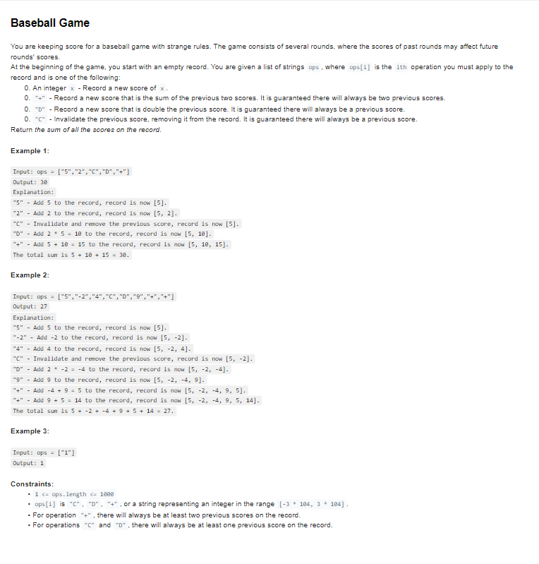

# Interview Preparation

## Glossaries

- **[Cloud Computing](./cloud_computing.pdf)**
- **[HTML, CSS & JavaScript](./html_css_javascript.pdf)**
- **[Git & GitHub](./github.pdf)**
- **[React](./react.pdf)**
- **[Node & Express.js](./node_express.pdf)**
- **[Docker & Kubernetes](./docker_kubernetes.pdf)**
- **[Microservices](./microservices.pdf)**

## Tools

- **[Full-Stack Roadmap](https://roadmap.sh/full-stack)**: A visual roadmap to track the skills and technologies needed to become a fullstack developer. Useful for identifying gaps in your knowledge or revisiting specific topics.

## Exercises & Questions

- **[Exercism](https://exercism.org/tracks)**
- **[LeetCode](https://leetcode.com/problemset)**
- **[GreatFrontEnd — Coding Questions](https://www.greatfrontend.com/questions)**
- **[React Interview Questions](https://ca.indeed.com/career-advice/interviewing/reactjs-interview-questions)**
- **[GreatFrontEnd — Behavioral Questions](https://www.greatfrontend.com/behavioral-interview-guidebook)**

### Turing Exercises

