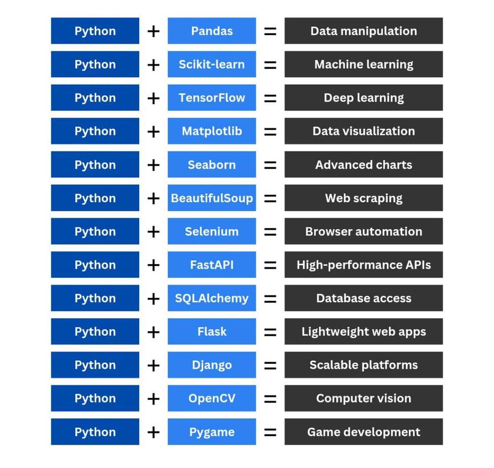

# Python

## References

- **[Python Documentation](https://docs.python.org/3.14/)**
- **[NumPy Documentation](https://numpy.org/doc/)**
- **[Pandas Documentation](https://pandas.pydata.org/docs/)**

## Tips & Tricks

1. This is the correspondent package for each functionality:

   

2. The result of `int(3.99)` will equal 3, not 4

3. `r""` - raw string, will not interpret \n or others

4. `list2 = list1[:]` - to clone a list without referencing the original one while modifying the copy one.
