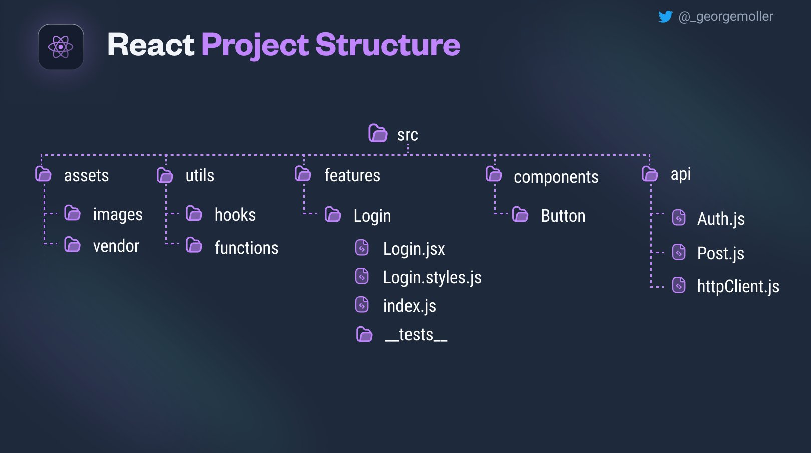

# React

## References

- **[React Documentation](https://react.dev/learn)**
- **[React Router Documentation](https://reactrouter.com/home)**

## Tools

- **[React SVGR](https://react-svgr.com/playground/)**: here you can convert SVG code into JSX to utilize it as a dynamic React component

## Libraries

- **[Framer Motion Documentation](https://www.framer.com/motion/)**: This is a library that allows you to animate React components in an easier and faster way. Also allows to animate SVG's in React

- **[Floating UI](https://floating-ui.com/docs/getting-started)**: This is a library for creating floating components (_elements that are floating in a certain place of the screen_) which are responsive

## Tips & Tricks

1.  All the `useState` and `useEffect` logic try to divide it into custom hooks, that way the code will be cleaner and more organized and you would have the hooks to reuse them on future projects easier and faster.

2.  This image illustrates an advisable way to organize the folders in your React projects:
    

### React Router

3.  You can use the `HashRouter` component, especially if you have cases where URLs on your page encounter issues when accessed from another location. This is a common occurrence with shared hosting. Nevertheless, it's generally better to use `BrowserRouter`.

4.  If you rename a file just changing the case of the letters, VSCode maybe throw some error. so then rename the file to a different name and rename it correctly again. It should be fine then
